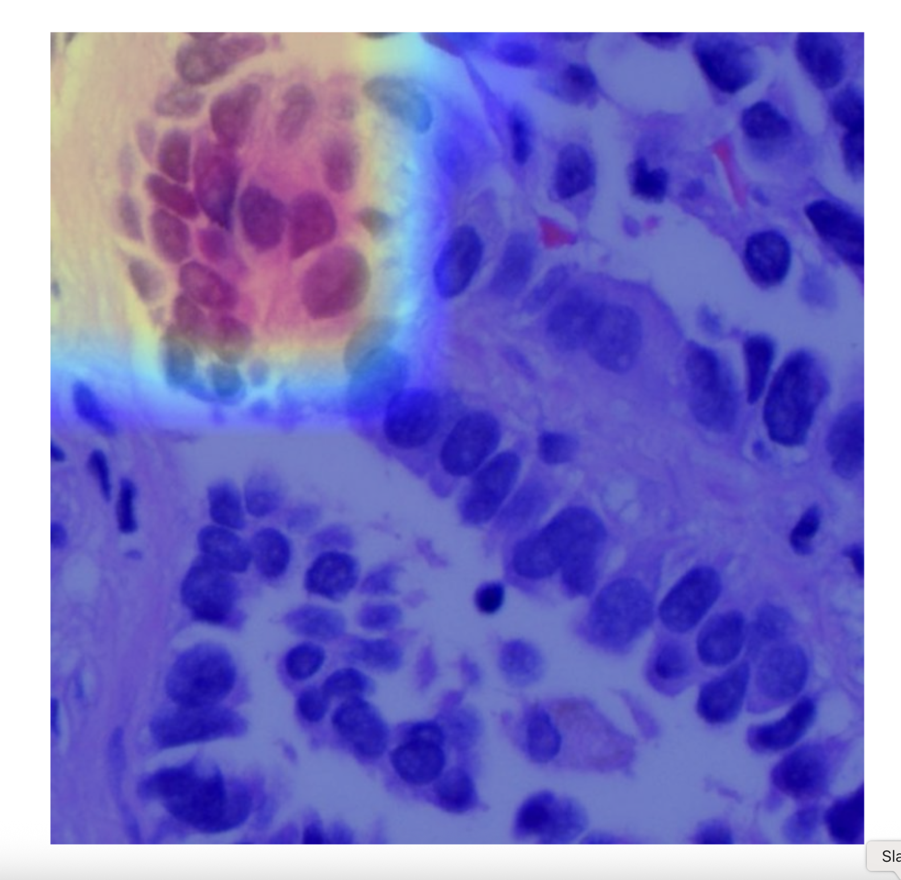

# 🫁 Lung Histopathology Cancer Detection and Explanation using Deep Learning and LLMs


> An interpretable AI system combining CNN classification, GradCAM visualizations, and Claude LLM-based clinical reasoning for lung cancer detection from histopathology images.

---

## 🚀 Project Structure

| File/Folder | Description |
|:------------|:------------|
| `.streamlit/` | Configuration folder for Streamlit secrets |
| `data/data_raw/` | Raw images organized into `lung_aca`, `lung_n`, `lung_scc` classes |
| `data/train/`, `data/val/` | Split training and validation datasets |
| `app.py` | Streamlit app for upload, prediction, GradCAM and LLM commentary |
| `prepare-dataset.py` | Script to split raw data into training and validation |
| `lung_cancer_classifier.py` | Training script for ResNet-18 model |
| `best_lung_cancer_classifier.pt` | Best performing model checkpoint |
| `final_lung_cancer_classifier.pt` | Final model checkpoint |
| `training_metrics.png` | Plot showing accuracy and loss during training |
| `requirements.txt` | List of required Python packages |
| `README.md` | Project overview and setup instructions |

---

## 🖼️ How the System Works

1. **Image Upload**: Upload a histopathology image via the Streamlit app.
2. **CNN Prediction**: Classify the image into:
   - Lung Adenocarcinoma
   - Lung Squamous Cell Carcinoma
   - Normal Lung Tissue
3. **GradCAM Heatmap**: Visualize model attention regions influencing the prediction.
4. **LLM Explanation**: Generate human-readable clinical commentary using Claude 3.7 or 3.5 through AWS Bedrock.

---

## 📊 Model Training

- Model: **ResNet-18** (pretrained and fine-tuned)
- Optimizer: **Adam** (`lr=1e-4`)
- Loss: **Cross Entropy Loss**
- Epochs: **10**
- Device: **MPS (Apple Silicon)** or CPU fallback
- Achieved **~99.9% validation accuracy**
- Training metrics (accuracy/loss) plotted and saved.

---
## Pre-Requisites
### Enable Model Access in AWS Account
Refer link for details - https://docs.aws.amazon.com/bedrock/latest/userguide/model-access-modify.html

You need to enable access for Claude 3.7

### Model Configuration

#### Important Note About Model ID
The model_id in the configuration must be updated with the corresponding Amazon Bedrock model inference ARN. This is crucial for successful model invocation.

Example format for 3.7:
```bash
arn:aws:bedrock:us-east-1:<aws account id>:inference-profile/us.anthropic.claude-3-7-sonnet-20250219-v1:0
```
Example format for 3.5:
```bash
anthropic.claude-3-5-sonnet-20240620-v1:0
```

## Create virtual environment
```bash
python -m venv hrvenv
```

## Activate virtual environment
### On Windows
```bash
hrvenv\Scripts\activate
```
### On macOS/Linux
```bash
source hrvenv/bin/activate
```

### Install the requirements file:
```bash
pip install -r requirements.txt
```

### Create an AWS User
Sign in to AWS Management Console

Navigate to IAM (Identity and Access Management)

Click "Users" → "Add user"

Set username and enable "Access key - Programmatic access"

Attach necessary permissions (e.g., AWSBedrock)

Complete user creation and save the credentials securely

## 🛠️ Setup Instructions

1. Clone the repository:
   ```bash
   git clone https://github.com/amit94ece/AI_in_HealthCare.git
   cd high-risk-project

## Prepare the dataset:

Organize raw images into a data_raw/ folder by class.

## Run the dataset preparation script:
```bash
python prepare-dataset.py
```

## Train the CNN model:
```bash
python lung_cancer_classifier.py
```

## Start the Streamlit app:
```bash
streamlit run app.py
```

## 🔐 Important Notes
AWS Bedrock credentials (AWS_ACCESS_KEY_ID, AWS_SECRET_ACCESS_KEY, AWS_REGION) must be configured in .streamlit/secrets.toml.

Example:
```bash
AWS_ACCESS_KEY_ID = "<Your Access Key>"
AWS_SECRET_ACCESS_KEY = "<Your Secret Key>"
AWS_REGION = "<Your regions>"
```

### Claude models used:
- Claude 3.7 Sonnet
- Claude 3.5 Sonnet
- Bedrock region used: us-east-1

## 📷 Screenshots

CNN Prediction and GradCAM Visualization



LLM-Generated Clinical Commentary


## 📌 Acknowledgements
Dataset: Lung and Colon Histopathological Image Dataset

Model Backbone: TorchVision ResNet-18

LLMs: Claude 3.7 Sonnet and Claude 3.5 Sonnet via AWS Bedrock

## ✨ Future Work
Incorporate additional cancer types and tissue modalities.

Integrate GPT-4o or specialized medical LLMs.

Conduct real-world evaluation with pathologists.

Enable clinician feedback loops into the system.

## Contributing

Feel free to fork this repository and submit pull requests with improvements or additional features.

## License
This project is open-source and available under the MIT License.


